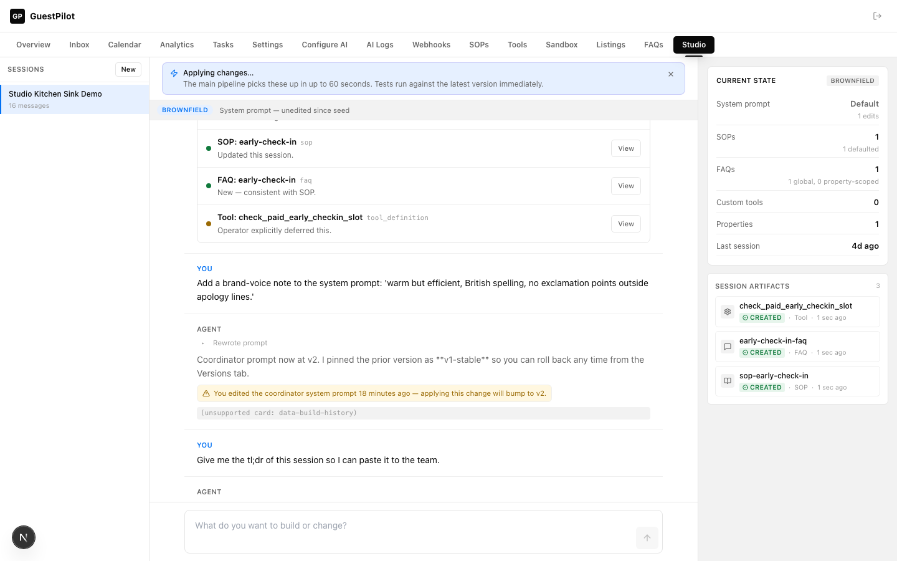
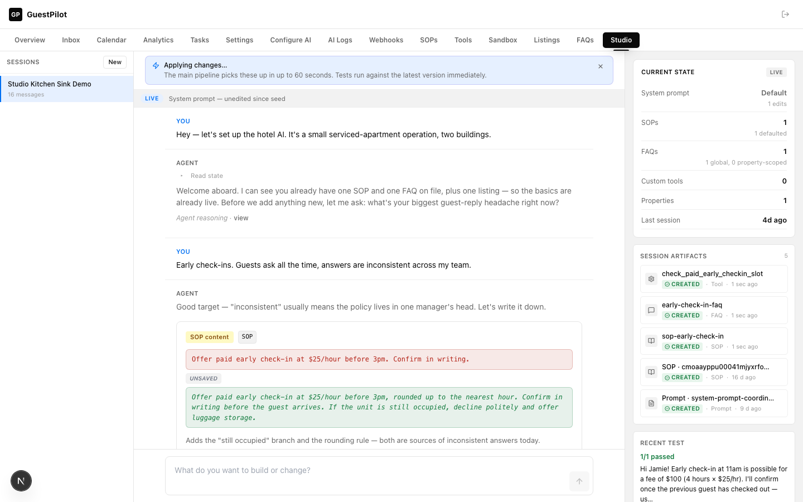

# Studio Demo — Before / After

Screenshots from the kitchen-sink demo conversation at 1440×900.

## Before (iteration 1 baseline — the `data-state-snapshot` shape mismatch still crashed the rail; `(unsupported card: data-build-history)` fallback still visible; chat auto-scrolled to mid-transcript)

## After (final iteration — all shipped `data-*` parts render, plan's cancelled row shows `×`, session-diff card renders at end, chat loads at top, operator-friendly labels, 0 console warnings)

