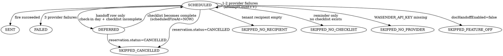

# Data Model: Check-in Document Handoff via WhatsApp

## Schema changes (`backend/prisma/schema.prisma`)

### `Tenant` — new fields

```prisma
// ─── Feature 044: WhatsApp doc-handoff config ───
// Null / empty means feature is off for the corresponding direction.
docHandoffManagerRecipient  String?  // phone number in E.164 (+…) or group JID (…@g.us)
docHandoffSecurityRecipient String?  // phone number in E.164 or group JID
docHandoffReminderTime      String   @default("22:00")  // HH:MM, Africa/Cairo
docHandoffTime              String   @default("10:00")  // HH:MM, Africa/Cairo
docHandoffEnabled           Boolean  @default(false)

documentHandoffStates       DocumentHandoffState[]
```

**Validation (application-level):**
- Time fields: `/^([01][0-9]|2[0-3]):[0-5][0-9]$/`.
- Recipient fields: `/^\+[1-9]\d{7,14}$/` OR (contains `@g.us`).
- `docHandoffEnabled` is the master switch. When false, the polling job skips the tenant entirely (status rows are still evaluated so lingering SCHEDULED rows don't silently pile up — they move to `SKIPPED_NO_PROVIDER`-equivalent "disabled" state).

### `DocumentHandoffState` — new table

```prisma
model DocumentHandoffState {
  id                String    @id @default(cuid())
  tenantId          String
  reservationId     String
  messageType       String    // 'REMINDER' | 'HANDOFF'
  status            String    // see enum list below — modelled as String for cheap extensibility, matches existing ToolDefinition/Task pattern
  scheduledFireAt   DateTime  // when the row should be evaluated next
  attemptCount      Int       @default(0)
  lastError         String?
  providerMessageId String?
  recipientUsed     String?   // snapshot at send time for audit (even if tenant later changes setting)
  messageBodyUsed   String?   @db.Text
  imageUrlsUsed     String[]  @default([])
  sentAt            DateTime?
  createdAt         DateTime  @default(now())
  updatedAt         DateTime  @updatedAt

  tenant      Tenant      @relation(fields: [tenantId], references: [id], onDelete: Cascade)
  reservation Reservation @relation(fields: [reservationId], references: [id], onDelete: Cascade)

  @@unique([reservationId, messageType])
  @@index([tenantId])
  @@index([status, scheduledFireAt])
}
```

**Status enum (string):**
- `SCHEDULED` — active, will be evaluated at `scheduledFireAt`.
- `DEFERRED` — handoff-on-check-in-day waiting for checklist completion.
- `SENT` — terminal success.
- `FAILED` — terminal after 3 consecutive provider failures.
- `SKIPPED_CANCELLED` — reservation cancelled.
- `SKIPPED_NO_RECIPIENT` — tenant's relevant recipient cleared at fire time.
- `SKIPPED_NO_CHECKLIST` — reminder only; no checklist ever created.
- `SKIPPED_NO_PROVIDER` — `WASENDER_API_KEY` missing at fire time.
- `SKIPPED_FEATURE_OFF` — `docHandoffEnabled` false at fire time.

### `Reservation` — no schema change

`Reservation.screeningAnswers.documentChecklist` JSON is extended (application-level, no migration) with:

```ts
interface DocumentChecklist {
  passportsNeeded: number;
  passportsReceived: number;
  marriageCertNeeded: boolean;
  marriageCertReceived: boolean;
  createdAt: string;
  updatedAt: string;
  createdBy: string;

  // ─── Feature 044 addition ───
  receivedDocs?: ReceivedDocRef[];
}

interface ReceivedDocRef {
  slot: 'passport' | 'marriage_certificate';
  slotIndex?: number;               // 1-based for passports; omitted for marriage cert
  hostawayMessageId: string;        // pointer back into conversation history
  imageUrls: string[];              // copies of Message.imageUrls at capture time
  capturedAt: string;               // ISO
  source: 'ai_tool' | 'manual';     // which code path attributed it
}
```

- Array order is append-only. If a manager later un-marks a received doc via `manualUpdateChecklist` (decrementing a count), the corresponding last-appended `ReceivedDocRef` for that slot is popped. This is the obvious default for the un-mark question left open during /clarify.
- On handoff send time, `receivedDocs` is flattened to a distinct `imageUrls` list preserving capture order.

---

## State machine — `DocumentHandoffState`



Terminal states: `SENT`, `FAILED`, all `SKIPPED_*`. Only transition out of terminal is never — row survives as audit record.

---

## Row creation & reschedule rules

### Insert points
| Trigger | Reservation state | Action |
|---|---|---|
| New reservation, check-in ≥ 2 days away | not cancelled | Insert both rows: `REMINDER` at `checkIn - 1day @ tenant.docHandoffReminderTime`, `HANDOFF` at `checkIn @ tenant.docHandoffTime`, both `SCHEDULED`. |
| New reservation, check-in is tomorrow | not cancelled, reminder time still in future | Insert both rows; reminder fires normally. |
| New reservation, check-in is tomorrow, reminder time already past today | not cancelled | Insert both rows; reminder `scheduledFireAt = NOW()` (send-immediately path, FR-012). |
| New reservation, check-in is today (walk-in) | not cancelled | Insert handoff row only. If checklist exists and is complete OR checklist does not exist, `scheduledFireAt = NOW()`. Else status `DEFERRED` with `scheduledFireAt = NOW()` (evaluator will re-check and keep it deferred until checklist completes). Skip reminder entirely. |
| New reservation, check-in is in the past | any | No rows inserted. |
| Checklist first created | reminder row exists and still `SCHEDULED` | No change. The creation alone does not re-schedule. |
| Manager marks a doc received | `HANDOFF` row is `DEFERRED` | Re-check completeness. If complete now: set `status='SCHEDULED'`, `scheduledFireAt=NOW()`. |

### Reschedule points (on reservation update)
| Change | Action |
|---|---|
| `checkIn` date moves | For `REMINDER` and `HANDOFF` rows still `SCHEDULED` or `DEFERRED`: recompute `scheduledFireAt` from new dates. Terminal rows untouched. |
| `status` → `CANCELLED` | `SCHEDULED` or `DEFERRED` rows → `SKIPPED_CANCELLED`. Terminal rows untouched. |

### Polling evaluator per tick
For each row in `status IN ('SCHEDULED','DEFERRED') AND scheduledFireAt <= NOW()`:
1. Reload current `Reservation` + `Tenant` (tenant isolation enforced by query filter).
2. Guard checks in order; first match wins:
   - Reservation cancelled → `SKIPPED_CANCELLED`.
   - `docHandoffEnabled` false → `SKIPPED_FEATURE_OFF`.
   - `WASENDER_API_KEY` env missing → `SKIPPED_NO_PROVIDER`.
   - Relevant recipient field empty → `SKIPPED_NO_RECIPIENT`.
   - If `messageType='REMINDER'` and no checklist → `SKIPPED_NO_CHECKLIST`.
   - If `messageType='HANDOFF'` and status currently `DEFERRED`:
     - If checklist still incomplete → no-op (leave `DEFERRED`, re-tick later).
     - If checklist now complete → fall through to render+send.
3. Render message body and image URL list from current state.
4. Call `wasender.service.ts` for each payload (text-only first if there are images; then one-image-per-call).
5. On success: `status='SENT'`, snapshot `recipientUsed`, `messageBodyUsed`, `imageUrlsUsed`, `providerMessageId`, `sentAt=NOW()`.
6. On failure: `attemptCount++`, `lastError=error.message`. If `attemptCount >= 3`: `status='FAILED'`. Else keep `SCHEDULED`, push `scheduledFireAt = NOW() + backoff` (5 min, 15 min).

---

## Query patterns

- **Polling tick**: `prisma.documentHandoffState.findMany({ where: { status: { in: ['SCHEDULED','DEFERRED'] }, scheduledFireAt: { lte: new Date() } }, take: 500 })`. Indexed on `(status, scheduledFireAt)`.
- **Settings page "recent sends"**: `findMany({ where: { tenantId }, orderBy: { updatedAt: 'desc' }, take: 20 })`. Indexed on `tenantId`.
- **On reservation update**: `updateMany({ where: { reservationId, status: { in: ['SCHEDULED','DEFERRED'] } }, data: { scheduledFireAt: newTs } })`.
- **Reservation cancellation**: `updateMany({ where: { reservationId, status: { in: ['SCHEDULED','DEFERRED'] } }, data: { status: 'SKIPPED_CANCELLED' } })`.

---

## Invariants

1. `(reservationId, messageType)` is unique — idempotency at the database layer.
2. `status='SENT'` ⇒ `sentAt IS NOT NULL` AND `providerMessageId IS NOT NULL`.
3. `status='DEFERRED'` ⇒ `messageType='HANDOFF'` (reminder is never deferred).
4. A row in `SENT`, `FAILED`, or any `SKIPPED_*` never transitions out.
5. `attemptCount` increments only on provider errors; skip-class transitions leave it at 0.
6. Image refs (`receivedDocs` array) are append-then-pop; never rewritten mid-array.
